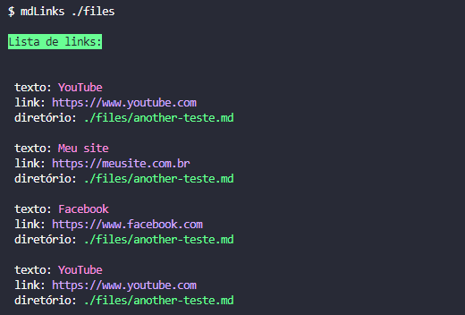
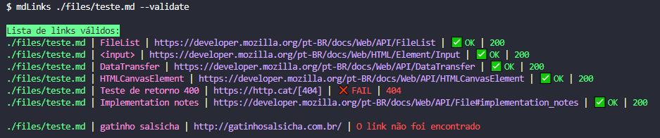
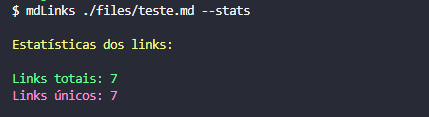
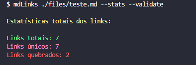
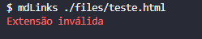
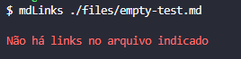
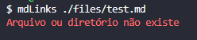
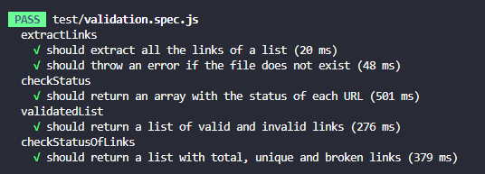
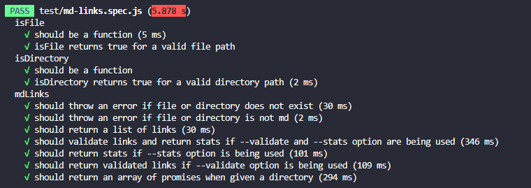
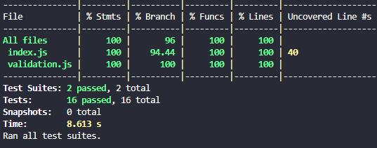

# Markdown Links

Quarto projeto desenvolvido junto ao bootcamp da [@Laboratória](https://www.laboratoria.la/br). O projeto Markdown Links enfoca o Back-End (NodeJS e JavaScript) e identifica links em arquivos markdown e seus respectivos status.  Pode ser executado através de CLI.

## Índice

* [1. Resumo do projeto](#1-resumo-do-projeto)
* [2. Funcionalidades](#2-funcionalidades)
* [3. Como usar esta biblioteca](#3-como-usar-esta-biblioteca)
* [4. Mensagens de erro](#4-mensagens-de-erro)
* [5. Testes unitários](#5-testes-unitários)
* [6. Considerações técnicas](#6-considerações-técnicas)
* [7. Contato](#7-contato)

***

## 1. Resumo do projeto

[Markdown](https://pt.wikipedia.org/wiki/Markdown) é uma linguagem de marcação
muito popular entre os programadores. É usada em muitas plataformas que
manipulam texto (GitHub, fórum, blogs e etc) e é muito comum encontrar arquivos
com este formato em qualquer repositório. Os arquivos Markdown normalmente contém links que podem estar quebrados, ou que já não são válidos, prejudicando muito o valor da
informação que está ali.

Neste projeto, foi criada uma biblioteca, executável através de linha de comando (CLI), que lê e analisa os arquivos no formato Markdown, verificando quais arquivos contêm links e mostrando suas estatísticas.

## 2. Funcionalidades

* **Listagem de links**: exibe quais links estão disponíveis no arquivo indicado ou nos arquivos pertencentes à pasta indicada.
* **Validação de links**: indica quais links estão ativos ou fora do ar, retornando uma mensagem ("ok", "fail", "o link não foi encontrado") e o status HTTP.
* **Estatísticas dos links**: exibe um apanhado geral dos links no arquivo, sendo eles: links totais, links únicos e links quebrados.

## 3. Como usar esta biblioteca

1. Para realizar a instalação, execute o seguinte comando no terminal `npm install md-links-lineguise`

2. Executando o comando `md-links ./caminhoDaPasta` ou `md-links ./caminhoDaPasta/nomeDoArquivo.md`, os links serão retornados da seguinte maneira:

3. Ao inserir a flag `--validate` após o comando já mencionado acima, as informações serão retornadas conforme abaixo:

4. Substituindo pela flag `--stats`:

5. Combinando ambas as flags `--stats --validate`:

## 4. Mensagens de erro

* Caso o arquivo indicado não tenha a extensão .md:

* Caso o arquivo indicado não tenha links:

* Caso o arquivo ou o diretório não existam:

## 5. Testes unitários

Este projeto conta com duas suítes de testes para garantir sua confiabilidade e qualidade.

## 6. Considerações técnicas

**Linguagens utilizadas:** JavaScript | Node.js

**Programas/Plataformas utilizadas:** VSCode (codificação) | Trello (planejamento)

## 7. Contato

**Aline Guiseline** 💙 

https://www.linkedin.com/in/alineguiseline/